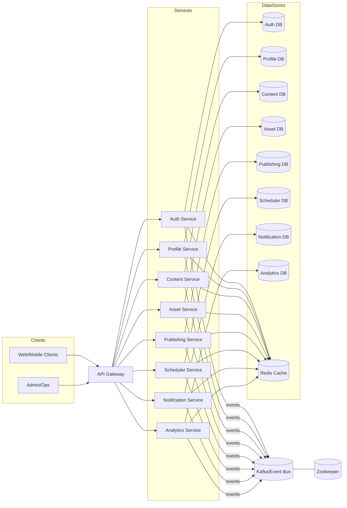
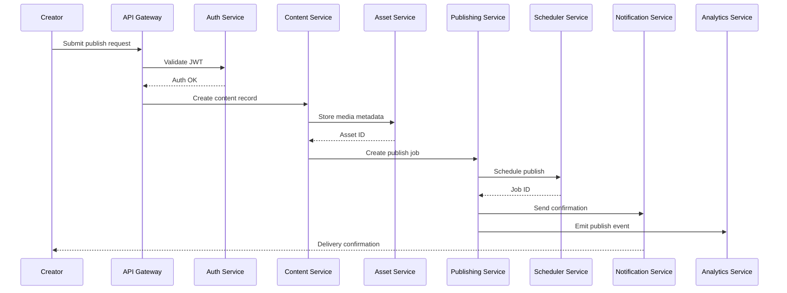
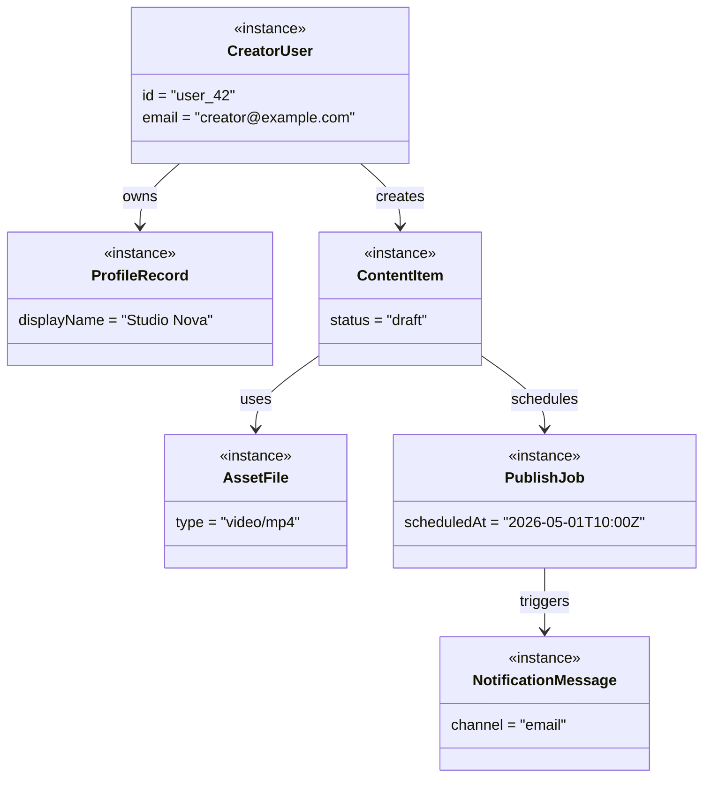
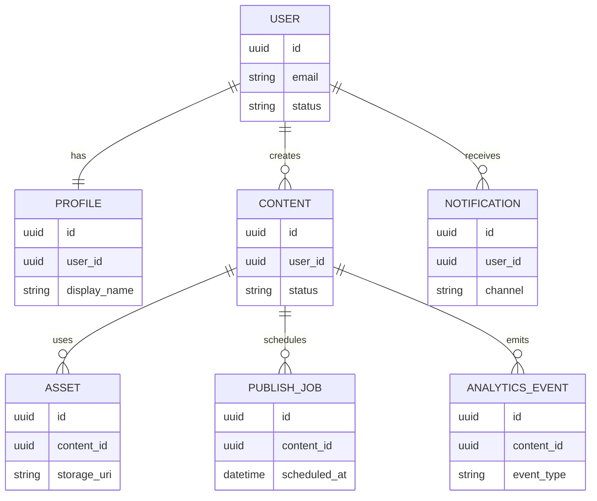

# Architecture and Workflow Diagrams

This document provides high-level system diagrams for CreatorOS Backend. Diagrams use Mermaid syntax so they can be rendered directly in Markdown viewers that support Mermaid.

## Architecture Diagram



## Workflow Diagram (Publish Content)



## Use Case Diagram

```mermaid
usecaseDiagram
  actor Creator
  actor Admin

  Creator --> (Authenticate)
  Creator --> (Manage Profile)
  Creator --> (Create Content)
  Creator --> (Upload Assets)
  Creator --> (Publish Content)
  Creator --> (Schedule Posts)
  Creator --> (View Analytics)
  Creator --> (Receive Notifications)

  Admin --> (Manage Users)
  Admin --> (Monitor System Health)
  Admin --> (Review Event Streams)
```

## Object Diagram (Sample Instances)



## ER Diagram


